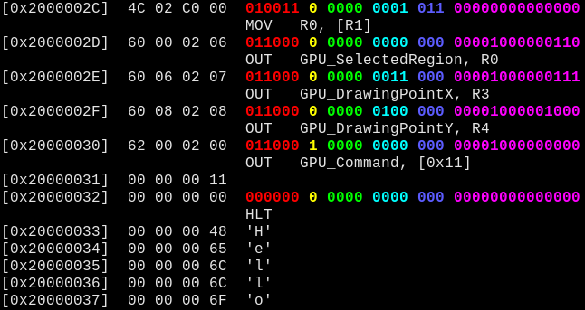

# v32tools

A set  of handy  Vircon32 tools,  for a variety  of debugging  and fringe
purposes.

There are tools  for binary/data analysis, obscene  peripheral hacks, and
simulators/debuggers.

## BUILDING

To build the v32tools, change into the respective tool's subdirectory and
run `make`

Executable files will be stored in `bin/`.

## INSTALL

To install, also from the tool's subdirectory, run `make install`

Tool will install into current user's `~/bin/` directory.

## v32cat

Like the UNIX `cat` tool, **v32cat**  will display (in hex) and highlight
recognized sections of Vircon32-related data.

Meant  to  be  used  with  Vircon32 VBIN  object  files  and  V32  packed
cartridges.

The  aim is  to provide  a quick  and informative  means of  studying the
low-level  data in  the  cartridge,  be it  for  learning  about how  the
system works /  studying Computer Organization-style topics,  or to debug
problems.

While  other   text-based  hex-processing   tools  exist   (`xxd`,  `od`,
`hexdump`,  etc.), they  generally  want  to work  in  units of  singular
bytes, while  Vircon32's 32-bit  word size  and addressing  means without
significant reconfiguration,  the offsets  from these  other command-line
tools can be off by up to a factor of 4 (4 bytes = 1 V32 word). This adds
unnecessary overhead  to the typical exploration,  so **v32cat** attempts
to fill this niche.

**v32cat** supports `getopt(3)`-style command-line arguments. Run it with
the `-h` or `--help` argument to get  a list of available options you can
apply.

```
Usage: v32cat [OPTION]... FILE
Display hex representation of bytes read from FILE.

Mandatory arguments to long options are mandatory for short options too.

  -a, --address=ADDR         highlight WORD at ADDR
  -A, --adjust-offsets       render offsets from CART origin
  -b, --binary               display binary in decode mode
  -1, --column               force one WORD column output
  -d, --decode               decode instructions in-line
  -f, --fancy                enable fancy content rendering
  -F, --file                 reference offset from file
  -m, --memory               reference offset from memory
  -r, --range=ADDR1-ADDR2    highlight WORDs in ADDR range
  -R, --raw                  no fancy content or colors
  -s, --start=ADDR           start processing at ADDR
  -S, --stop=ADDR            stop processing at ADDR
  -W, --width=WIDTH          set line WIDTH (in bytes)
  -w, --wordsize=SIZE        set WORD size to SIZE (in bytes)
  -v, --verbose              enable operational verbosity
  -h, --help                 display this usage information
```

### default

By default, when not passed through a pipe or redirected, **v32cat** will
recognize V32 headers, highlight and render their content:


Since  most cartridges  will  likely  take up  way  more  space than  our
terminal allows, to avoid it defaulting to colorless, renderless mode, we
can run **v32cat** with the `--force` option.

### decode

With  the `--decode`  option, **v32cat**  will, for  the `VBIN`  section,
decode the raw  hex bytes and display the  disassembled Vircon32 assembly
code:


### decode with binary

With the  `--binary` option (in conjunction  with `--decode`), **v32cat**
will,  during the  `VBIN` section  instruction decode,  also display  the
binary of the instruction word,  color-coded (if enabled), and spaced out
by section.



### raw

With all this fanciness, we may occasionally want to see everything as it
is; to do that, we run **v32cat** with the `--raw` option:


### VTEX pixels

It  will  even get  fancy  with  VTEX  pixels, de-endianifying  them  and
rendering them in the color of their respective channel (R G B A):


## v32ls

Like the UNIX `ls` tool, **v32ls**  will output the found V32 headers and
common  attributes for  each  section.  Much as  **v32cat**  can do,  but
designed to be in a more top-down readable and concise format.

The idea is that  you can get a quick overview  of a particular cartridge
with **v32ls**, then take that information (the `offsets`) and apply them
to your pursuits with **v32cat**.

**v32ls** should  also be more  performant than **v32cat**  in traversing
the file, due to not needing to encounter each and every byte/word inside
each section. Through the use of  `fseek(3)`, and being able to calculate
the total  size of the  current section,  seeks are performed  to quickly
jump from section to section.

### default

By default, **v32ls** will locate and display (in order from the start of
the file): each V32 header, and its starting offset.

### verbosity

With the inclusion of the `-l`, `-v`, or `--verbose` argument, additional
V32 header information will be displayed.

## v32sim

This is an attempt at a  Vircon32 simulator, meant for debugging assembly
code programs written for the system.

It has a simple text interface,  aiming to really only target a debugging
interface similar to that of `gdb`.

With  it,  one can  single-step  through  a running  program,  displaying
various  registers and  memory locations,  watching as  they change  from
instruction to instruction.

## v32kbd

This is an attempt at a  Vircon32 in-game "driver" for receiving keyboard
keystrokes from an  external keyboard communicating with the  system as a
gamepad.

It  requires the  host  system to  be interfaced  with  the USB  "gadget"
presenting the keyboard as a gamepad.

Very much a work  in progress: while I believe the  code compiles, it has
yet to be tested.

The idea  is that  this will  be an  `#include`'ed file  in a  Vircon32 C
program (the  driver/library/API is in  a file called  `keyboard.h`). The
probe/read  function is  run every  few  frames to  check the  designated
gamepad  for  values,  which  will  then be  demultiplexed  into  a  byte
corresponding with a keyboard input.

## kbd2pad

This is a program to be run on  the Linux host configured to act as a USB
device, translating keyboard inputs into gamepad buttons.

Very much  a work  in progress:  still in the  midst of  establishing the
configuration of USB gadgets in Linux, and still need to adapt `getkey.c`
to fully meet the intended needs of `v32kbd`.

This isn't functional yet, it doesn't really do anything yet. Good things
come to those who wait.
